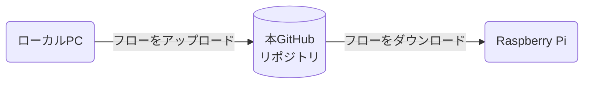

# Raspberry PiのSense HATに天気情報を表示

## イベント開催には、天気の情報が重要

## ラズパイとSense HATのLEDを用いて天気情報を伝える仕組みを開発

## 天気情報提供サービス「OpenWeather」
天気情報を取得するため、[OpenWeather](https://openweathermap.org/)というサービスを利用。
本サービスはアカウントを作成すると、無料で1000回/日だけ天気情報を取得可能。

Node-REDからOpenWeatherへのアクセスには、Node-REDプロジェクト公式の下記ノードを使用。

https://flows.nodered.org/node/node-red-node-openweathermap

## 開発したフロー

Sense HATのLEDに情報を表示する度に、OpenWeather APIにアクセスするとAPIの使用回数の上限に達してしまう。
これを避けるため、取得した情報をコンテキストに保存しておく様にし、LEDに表示する際はコンテキストの情報を使用する。

## Sense HATエミュレータでの動作
Sense HATシミュレータのノードを用いてPC上でフローを開発。上手く動作すると下の様に、天気の情報が表示される。

https://flows.nodered.org/node/node-red-node-pi-sense-hat-simulator

https://user-images.githubusercontent.com/20310935/233776400-85e7d697-5995-462f-9796-5186ccbf0c97.mp4

## Sense HAT実機での動作
シミュレータで期待通り動作することを確認した後、Git連携機能を利用してGitHubリポジトリにフローを置いた。その後、Raspberry Piでフローをダウンロードして、Sense HAT実機でも同じ様に動作するか確認。

Raspberry Pi上では、Sense HATシミュレータのノードをSense HAT実機用のノードに置き換えた。

https://user-images.githubusercontent.com/20310935/235315974-e0c3bb9c-2624-4ae7-b74c-a0d8ef865093.mp4

